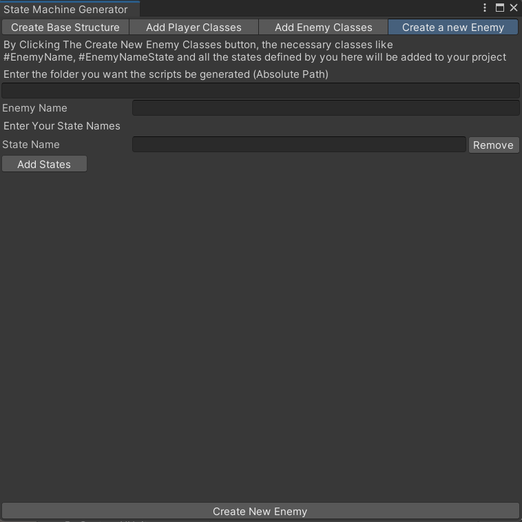
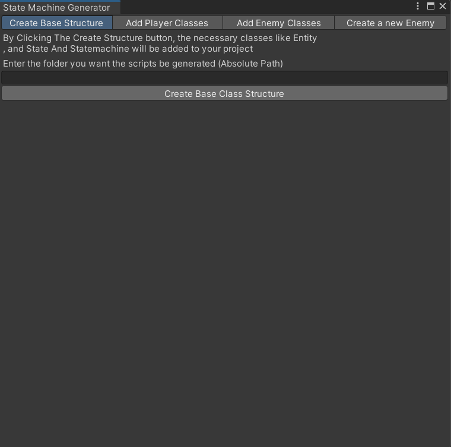
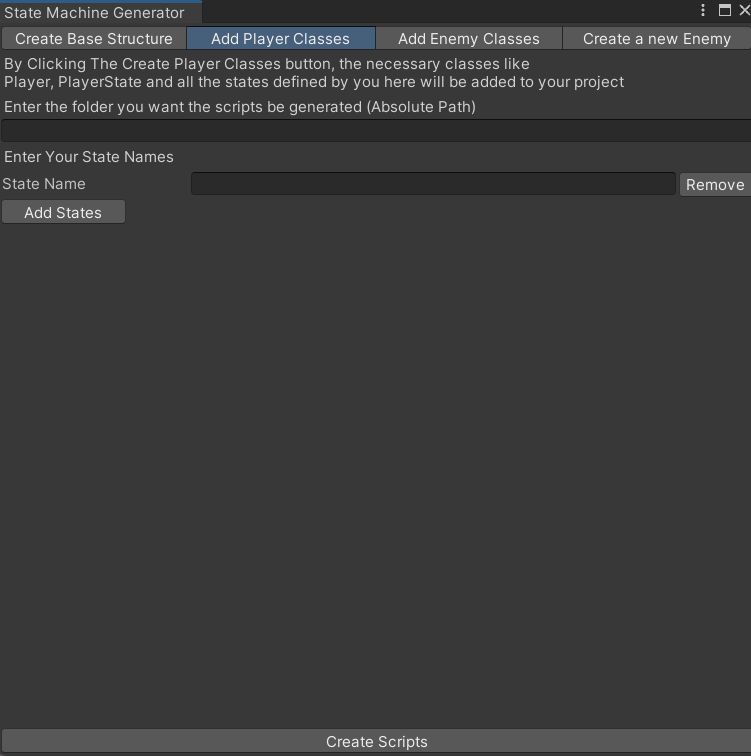
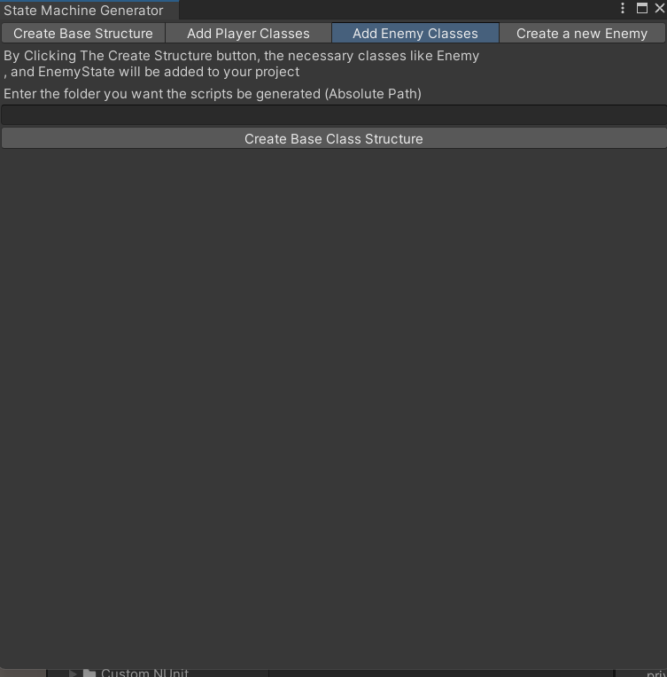
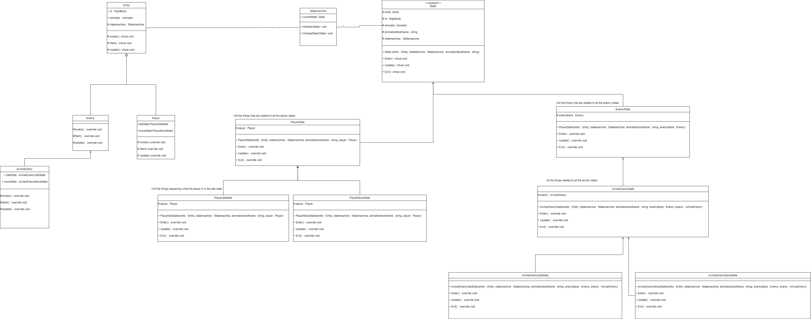

  

# Statemachine Generator

The **Statemachine Generator** is a Unity tool designed to simplify and streamline the creation of state machines in your project. This tool eliminates the redundancy of manually copying and re-writing code for different states, allowing you to focus more on gameplay logic rather than boilerplate code.

## Screenshots

## How to Use

1. Open the tool from **Tools > IcarusTools > State machine Generator**.
2. Use the **Base Scripts** panel to create your foundational state machine scripts.
3. Switch to the **Player Scripts** panel to create and manage player-specific states and transitions.
4. Use the **Enemy Base Scripts** panel for creating enemy base logic.
5. Finally, use the **Enemy States** panel to create new enemies and define their behaviors.

Each panel is designed to minimize redundancy and generate clean, organized code for you.

## Code Structure

The generated code follows a well-organized structure, keeping your state machine classes modular and manageable. You can review the class hierarchy and relationships in the diagram below.

*Note: The full diagram file is available in `Assets/Diagrams` if the image is not fully visible.*

## Installation

1. Download the package from [Link to Download](https://github.com/alithegreat74/State-Machine-Generator/releases).
2. Import the package into your Unity project.
3. Open the **State Machine Generator** from the Tools menu.
